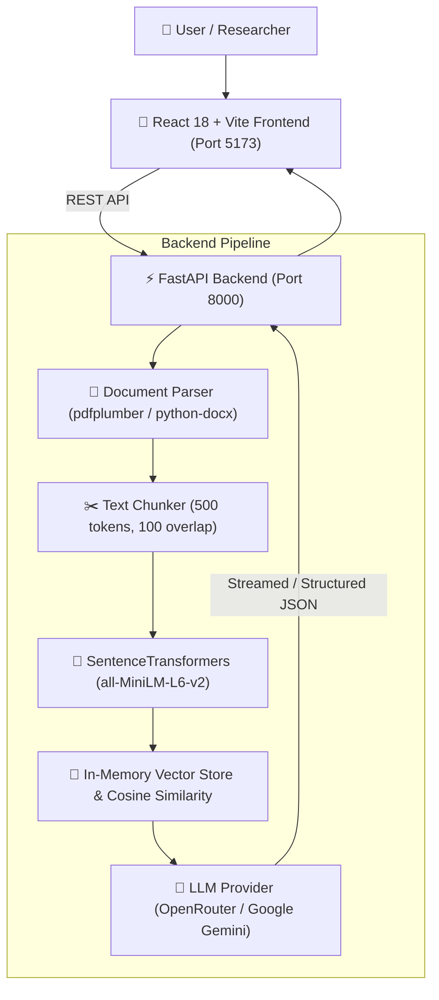

# 🔬 ResearchAI — Prodapt RAG Research Assistant

An intelligent, full-stack Retrieval-Augmented Generation (RAG) platform designed to ingest multi-format research documents (PDF, DOCX, TXT), perform local vector embeddings, extract key takeaways, generate cross-document summaries, and answer natural-language queries with inline source citations.

---

## 🌟 Key Features

- 📄 **Multi-Format Ingestion**: Upload PDF, DOCX, and plain text files seamlessly.
- ⚡ **Local Embedding & Retrieval**: Zero vector-database overhead; uses `SentenceTransformers` (`all-MiniLM-L6-v2`) and NumPy cosine similarity for lightning-fast retrieval.
- 🧠 **Dual LLM Provider Support**:
  - **OpenRouter API** (Default: `meta-llama/llama-3.3-70b-instruct` or any model slug).
  - **Google Gemini API** (`gemini-2.0-flash` fallback).
- 📝 **Document Summarization**: Single-document and synthesized cross-document executive summaries.
- 💡 **Key Insights Extraction**: Automatically extracts 5–8 bulleted insights linked to specific source page numbers.
- 💬 **Grounded RAG Chat**: Interactive Q&A strictly grounded in your uploaded documents with inline citations (`[filename, page X]`).
- 🎨 **Modern Bespoke Interface**: React 18 SPA built with custom design tokens, micro-animations, and a built-in Demo Mode toggle for offline testing.

---

## 🏗️ System Architecture



---

## 🛠️ Technology Stack

### **Frontend**
- **Framework**: React 18 (Vite)
- **Styling**: Modern Vanilla CSS with CSS Variables & Glassmorphism Design System
- **Icons**: Inline SVG / Custom Design System

### **Backend**
- **Framework**: FastAPI + Uvicorn
- **Language**: Python 3.11+
- **Embeddings**: `sentence-transformers` (`all-MiniLM-L6-v2`)
- **LLM Integrations**: `httpx` (OpenRouter API), `google-genai` (Gemini API)
- **Document Parsers**: `pdfplumber`, `python-docx`
- **Math/Vector Ops**: `numpy`, `torch`

---

## 🚀 Quick Start Guide

### 1. Clone the Repository
```bash
git clone https://github.com/hariprasadg2006/Prodapt.git
cd Prodapt
```

---

### 2. Backend Setup

```bash
cd backend

# Create virtual environment (optional but recommended)
python -m venv venv
# On Windows:
venv\Scripts\activate
# On macOS/Linux:
source venv/bin/activate

# Install dependencies
pip install -r requirements.txt
```

#### Configure Environment Variables (`backend/.env`)
Create a `.env` file inside the `backend` directory:

```env
# Recommended: OpenRouter API Key (Supports Llama 3.3 70B, DeepSeek R1, GPT-4o)
OPENROUTER_API_KEY=sk-or-v1-YOUR-KEY-HERE
OPENROUTER_MODEL=meta-llama/llama-3.3-70b-instruct

# Fallback: Google Gemini API Key
GEMINI_API_KEY=YOUR-GEMINI-API-KEY
```

#### Start FastAPI Server
```bash
uvicorn main:app --host 127.0.0.1 --port 8000 --reload
```
> Server running at: `http://127.0.0.1:8000`

---

### 3. Frontend Setup

Open a new terminal window:

```bash
cd frontend

# Install dependencies
npm install

# Start development server
npm run dev
```
> Application running at: `http://localhost:5173`

---

## 🔌 API Endpoints Summary

| Method | Endpoint | Description |
| :--- | :--- | :--- |
| `GET` | `/health` | Server health check endpoint |
| `POST` | `/upload` | Upload multiple PDF/DOCX/TXT files; parses, chunks & embeds |
| `POST` | `/summary` | Generate single or cross-document executive summaries |
| `POST` | `/insights` | Extract key insights with page-level citations |
| `POST` | `/chat` | RAG Q&A query grounded in document context |
| `GET` | `/session/{session_id}` | Fetch session metadata for rehydrating UI |

---

## 🛡️ License

Distributed under the MIT License. See `LICENSE` for more information.
